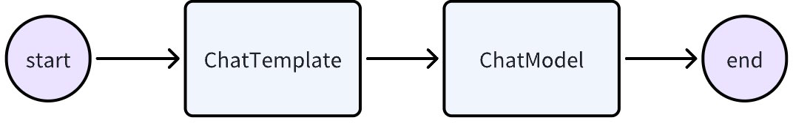
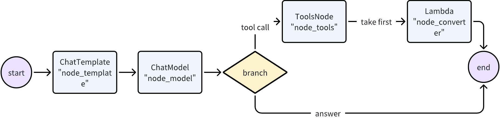
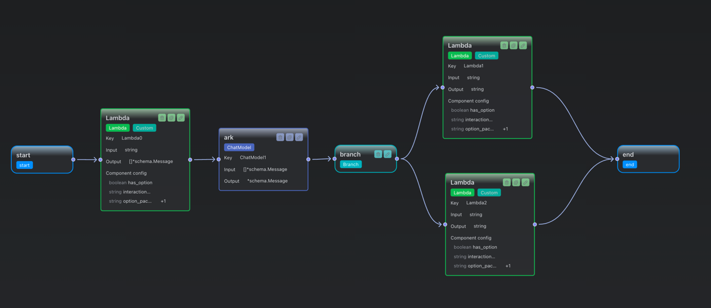
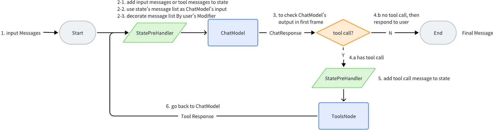

# 从 ChatModel 到 ADK 编排

- 本项目旨在展示如何从一个聊天模型（ChatModel）到一个自动化编排开发工具包（ADK）的使用。
- 单个大模型的能力有限，只是一个高级一点的api，而编排可以整合与协同、任务分解与自动化、灵活性与可扩展性，从而实现更强大的功能。
- 介绍的内容包括ChatModel、PromptTemplate、工具（Tool）、检索增强生成（RAG）、链式编排、图式编排、ReAct编排、多专家系统（MoE）编排以及最终的ADK编排。
- 代码示例将使用Go语言和eino库来实现。eino是cloudwego开源的大型语言模型（LLM）应用开发框架。[eino仓库地址](https://github.com/cloudwego/eino)
- 里面使用的模型和组件可以替换为其他类似的模型和组件，概念和方法是通用的。为了方便起见，示例中使用了Ark(火山引擎-豆包)的API。

## 1. ChatModel
- ChatModel是与大型语言模型（LLM）交互的基础组件。
- 它封装了与LLM通信的逻辑，处理输入输出。
- 就像一张会说话的 GPU 卡，你喂字符，它回字符，别的啥也不会，先让它‘开口’，再谈别的任务。 
- 示例curl：
```bash
curl https://ark.cn-beijing.volces.com/api/v3/chat/completions \
  -H "Content-Type: application/json" \
  -H "Authorization: Bearer $ARK_API_KEY" \
  -d $'{
    "model": "doubao-seed-1-6-251015",
    "max_completion_tokens": 65535,
    "reasoning_effort": "medium",
    "messages": [
        {
            "content": [
                {
                    "image_url": {
                        "url": "https://ark-project.tos-cn-beijing.ivolces.com/images/view.jpeg"
                    },
                    "type": "image_url"
                },
                {
                    "text": "图片主要讲了什么?",
                    "type": "text"
                }
            ],
            "role": "user"
        }
    ]
}'
```

## 2. PromptTemplate
- PromptTemplate用于定义与LLM交互时的提示模板。
- 它允许动态生成提示，以适应不同的上下文和需求。
- bad example:
```text
System: 你是一个聊天机器人。
User: 请帮我写一篇关于环境保护的文章。
```
- good example:(以f-string风格为例)
```text
System: 你是{role}。
User: 请帮我{task}
```

## 3. 工具（Tool）
- 工具是ChatModel的扩展，用于执行特定任务，如数据查询、计算等。
- 工具可以与ChatModel协同工作，增强其功能。
- 工具通常通过API或其他接口与外部系统交互，在AI Agent里面某个业务逻辑单元里执行特定任务。
- 例如示例里面模拟了创建一个资源检索工具，当用户请求特定信息时，工具会查询资源链接并调起浏览器跳转到相关资源页面。


## 4. 检索增强生成（RAG）
- RAG结合了信息检索和生成模型，减少大模型幻觉现象，提高回答的准确性和相关度,提升回答的准确性和相关性。
- 它通过检索相关文档，然后基于这些文档生成回答。
- 数据准备(收集文档)-索引(transformer、embedding、indexer)-检索(retriever)-生成是RAG的典型流程。

## 5. 链式编排
- 链式编排将多个ChatModel和工具按顺序连接，形成一个处理流程。
- 每个步骤的输出可以作为下一个步骤的输入，实现复杂任务的处理。
- 这就是一个很简单的链式编排示例，仅包含了上文介绍的组件chatModel和chatTemplate组件。


## 6. 图式编排
- 图式编排使用有向图来表示多个ChatModel和工具之间的关系。
- 这种方式允许更复杂的流程控制和并行处理。
- 图式编排可以更清晰地表达任务的依赖关系和执行顺序。

- 这是使用eino-dev图式编排可视化工具创建的一个简单图式编排示例截图
  


## 7. ReAct编排
- ReAct编排根据输入的变化动态调整处理流程。
- 思考（Reason）和行动（Act）
- 它能够根据上下文和环境的变化，灵活地选择不同的处理路径。



## 8. 多专家系统（MoE）编排
- MoE编排结合了多个专家模型，每个模型专注于特定领域。
- 根据输入的特性，动态选择最合适的专家模型进行处理。


## 9. ADK编排
- ADK编排是一个综合性的自动化编排开发工具包。
- 它集成了上述所有组件，提供一个完整的解决方案，用于构建复杂的LLM应用。
- ADK编排支持灵活的配置和扩展，适应各种应用场景。